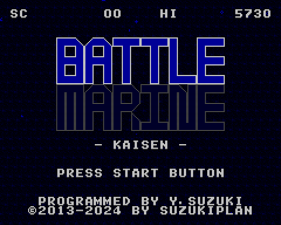

# WIP: Battle Marine for VGS-Zero

|Title|GamePlay|
|:-:|:-:|
|||

2013 年にスマートフォン向けゲームとしてリリース、その後 2019 年に [ファミコンに移植](https://github.com/suzukiplan/battle-marine-fc) されたあの「Battle Marine」（バトルマリーン）が [VGS-Zero](https://github.com/suzukiplan/vgszero) 対応ソフト第1弾として満を持して復活。

今回の Battle Marine は、従来までの「スナイプ＆ショット」の楽しさを継承しつつ、連魂（(C)SUZUKIPLAN）で好評だった「誘爆」によるコンボシステムを採用。

目指せ 999HIT!!

## How to Use

### Required Hardware

本ゲームの起動には次のハードウェアが必要です:

- RaspberryPi Zero 2W
  - [https://www.switch-science.com/products/7600](https://www.switch-science.com/products/7600)
  - [https://www.amazon.co.jp/dp/B0B55MFH1D/](https://www.amazon.co.jp/dp/B0B55MFH1D/)
- HDMI ケーブル (mini HDMI Type C → HDMI Type A)
  - [https://www.amazon.co.jp/dp/B08R7BVL7T/](https://www.amazon.co.jp/dp/B08R7BVL7T/)
- USB ジョイパッド（D-Pad+A/B+Start/Select）+ 変換アダプタ
  - [https://www.amazon.co.jp/dp/B07M7SYX11/](https://www.amazon.co.jp/dp/B07M7SYX11/)
  - [https://www.amazon.co.jp/dp/B08BNFKCYM/](https://www.amazon.co.jp/dp/B08BNFKCYM/)
- USB 電源
  - [https://www.amazon.co.jp/dp/B09T3C758Q/](https://www.amazon.co.jp/dp/B09T3C758Q/)
- micro SD カード
  - [https://www.amazon.co.jp/gp/aw/d/B08PTP6KKS/](https://www.amazon.co.jp/gp/aw/d/B08PTP6KKS/)
  - 最大 20MB 程度の空き容量が必要です（ゲーム本体: 最大16MB、ファームウェア: 約4MB）
- テレビなど（以下の条件のもの）
  - HDMI入力対応
  - リフレッシュレート60Hz
  - 解像度 480x384 ピクセル以上
  - オーディオ出力対応

> ジョイパッドは上記リストのものでなくても問題ありませんが、デフォルトのキー配置が想定通りでない場合があります。
>
> キー配置は [コチラ](https://github.com/suzukiplan/vgszero?tab=readme-ov-file#configsys) のドキュメントを参考にして [config.sys](./image/config.sys) を編集してください。

テレビではなくパソコンでプレイしたい場合、HDMI 対応のキャプチャーボードを利用して [OBS](https://obsproject.com/ja) などを用いれば簡単にプレイできるものと思われます。

本ゲームプレイ動画のインターネット動画配信サイトでの利用（収益化配信を含む）には制限がないので、[OBS](https://obsproject.com/ja) でそのまま ニコニコ生放送 や YouTube Live などで実況配信をしていただくことも可能です。もちろん、インタラクティブ配信（生放送）に限らず VOD 配信への制限も無いので、撮影した動画を編集してニコニコ動画やYouTubeへアップロードしていただいても問題ありません。（事前・事後の連絡も不要です）

### Launch Game

[image](./image) ディレクトリ配下のファイルを FAT32 フォーマットされた SD カードのルートディレクトリへ配置して、RaspberryPi Zero 2W に挿入して電源投入すればゲームが起動します。

### Joypad Usage

- START ボタンでゲーム開始
- 方向キーの左右で自機を移動
- B ボタンでショットを発射
- B ボタン長押しでレーザーをチャージ（満タンで離せばレーザーを発射）
- A ボタンでジャンプ & メダル収集（長押しで大ジャンプ）

## Game Play

### (Basic Information)

- 敵を破壊すると緑のメダルか赤いメダルが出てきます
- 緑のメダルを取ると LIFE が回復します
- 赤いメダルを取るとスコアが上昇します
- 一定の時間（120フレーム）以内に敵を倒し続けるとコンボが上昇し 100 HIT 以上になるとメダルが自動収集されます
- メダルはジャンプでも自動収集されます
- レーザー中は（発射モーションが完了後に）無敵です
- 通常の STG とは異なり爆発にも当たり判定があります

### (Advanced Information)

- LIFE が満タンの状態で緑のメダルを取り続けると赤いメダルの基礎点が上がり続けます
- LIFE が満タンの状態で緑のメダルを 16 個取る都度、画面下部の王冠の数が増えていきます
- 王冠の表示数の上限は 30 個（緑のメダル 480 個）ですが、王冠のカンストは 4,095個（緑のメダル 65,535 枚）です
- 敵弾などに衝突すると体力（LIFE）が減り、王冠の数が強かに減ります
- 一部の敵（カニ）を除き、レーザーで敵を倒すと赤いメダルが出てきます
- メダルの取得でもコンボの継続時間が 120 フレームに再セットされます

## License

[MIT](./LICENSE.txt)
